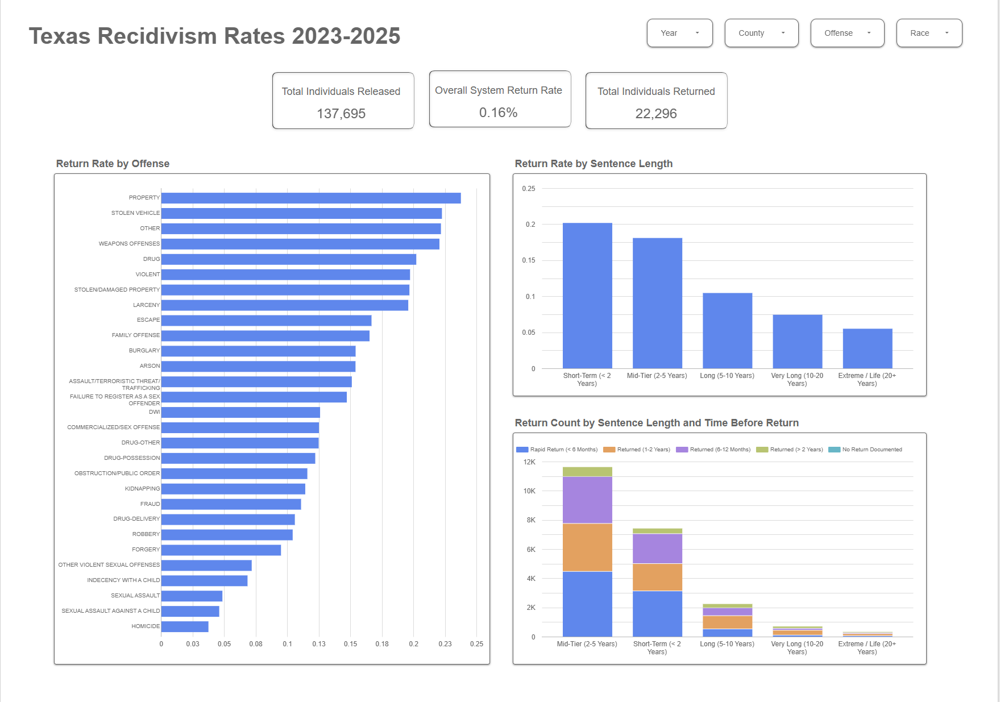

# 📊 Texas Criminal Justice: End-to-End Recidivism Cohort Pipeline & Cost-Optimized Modeling

👉 **[Click Here to Interact with the Live Looker Studio Dashboard](https://datastudio.google.com/reporting/509565d2-b49e-4d96-b0e8-206f5c9ab1d4)**

---

## 🛠️ Project Overview & Technical Architecture
This repository hosts a production-grade data engineering and analytics pipeline that tracks multi-year prison re-admission dynamics in Texas. By extracting administrative records across a four-year window (**2022–2025**), this project constructs a longitudinal cohort framework to analyze both the velocity and volume of recidivism.

[Raw Data 2022-2025] ──> (VS Code / Jupyter / Pandas) ──> (BigQuery Cloud Ingestion)
│
[Looker Studio Dashboard] <── (Optimized Production View) <── (Advanced SQL EDA & Modeling)

### 🧰 Tech Stack
* **Development Environment:** VS Code, Jupyter Notebooks
* **Data Ingestion & Preprocessing:** Python (Pandas, Google Cloud Client Libraries)
* **Cloud Data Warehouse:** Google BigQuery
* **Business Intelligence / Reporting:** Looker Studio

---

## 🚀 Step-by-Step Implementation

### 1. Extraction & Ingestion (Python)
Using Python inside Jupyter Notebooks within VS Code, I extracted raw statewide release and receive data spanning **2022 through 2025**. The automated preprocessing script handled basic data-type enforcement and pushed the datasets directly into Google BigQuery as staging tables.

### 2. Exploratory Data Analysis (SQL EDA)
Once the datasets were successfully landed in BigQuery, I executed focused exploratory data analysis to isolate data quality issues. A major structural hurdle was the `sentenceyears` column, which contained an alphanumeric mixture of exact years, month intervals, and text-based institutional designations (e.g., `'11 to 15 Years'`, `'9 to 10 Months'`, `'SAFPF'`, `'Life'`). 

### 3. Cost-Optimization & Query Refactoring
To treat this project like a production-scale enterprise pipeline, **I wrote two distinct versions of my SQL scripts**:
* **Version 1 (Initial Build):** Focused on baseline logic, regex parsing accuracy, and initial mapping rules.
* **Version 2 (Refactored & Optimized):** Specifically engineered to reduce bytes scanned and compute resources in BigQuery. By optimizing the parsing steps within structured Common Table Expressions (CTEs) and filtering out unnecessary scans before executing heavy non-equi joins, the finalized production view minimized cloud query costs. 

### 4. Data Modeling & Feature Engineering
The final, optimized SQL pipeline was deployed as a production view (`fct_recidivism_cohorts`). It dynamically transforms data via:
* **Regex Extraction Engines:** Utilizing `REGEXP_EXTRACT` to isolate bounding digits from mixed-type strings.
* **Deterministic Midpoint Normalization:** Calculating true mathematical averages for range brackets and standardizing month-long terms into continuous annual decimals (e.g., a `9 to 10 Months` bracket dynamically evaluates to `0.79` years).
* **Statutory Severity Buckets:** Aligning numeric sentence lengths into qualitative buckets (`Short-Term`, `Mid-Tier`, `Long`, `Extreme`) built around institutional reporting guidelines.

---

## 📊 Business Intelligence & Looker Dashboard
The engineered view serves as a semantic layer connected directly to Looker Studio. The front-end interface tracks core decision-making matrices:

* **Executive KPIs:** Total Individuals Released, Overall System Return Rate, and Total Individuals Returned.
* **Granular Visualizations:**
  * *Horizontal Bar Chart:* Return Rate by Offense Category.
  * *Vertical Bar Chart:* Return Rate by Sentence Length.
  * *Stacked Bar Chart:* Total Return Count broken down simultaneously by Sentence Length and Time Before Return (Velocity).

---

## 💡 Strategic Memorandum & Product Recommendations

### 1. Data-Driven Insights & Policy Interventions
Based on the visualized metrics, resources and supportive re-entry tracks should be immediately concentrated on two critical focal points:
* **Target Specific Offense Profiles:** The data establishes that individuals released from sentences involving **Property Crimes, Stolen Vehicles, Weapons Offenses, Violent Crimes, Stolen/Damaged Property, and Larceny** experience disproportionately higher return rates.
* **Intercept Shorter Sentences:** Counter-intuitively, individuals serving shorter sentence durations demonstrate significantly higher return rates. This indicates that short stays lack robust rehabilitative programming or post-release stabilization infrastructure compared to longer-term releases.

### 2. Strategic Product Recommendations for Recidiviz
Given Recidiviz's mission to build open-source data tools that help state agencies safely reduce incarceration rates, the findings from this pipeline suggest an opportunity for a new tool or feature expansion:

#### 🔮 Feature Concept: The "Re-entry Resource Matcher" (RRM)
State corrections departments often struggle with fragmented discharge planning. Recidiviz could develop a tool within their existing platform that automatically flags individuals scheduled for release based on the risk profiles surfaced in this pipeline.
* **Automated Risk-Tier Triggering:** When an individual with a short sentence or a high-risk offense profile (e.g., property, larceny, weapons) enters the 90-day pre-release window, the platform automatically flags them for intensified caseworker assignment.
* **Predictive Resource Allocation:** Instead of distributing post-release housing, substance use treatment, and job placement vouchers evenly, the tool would recommend allocating higher-intensity resource packages directly to these historically vulnerable cohorts—effectively shifting state spending from reactive re-incarceration to proactive community stabilization.
